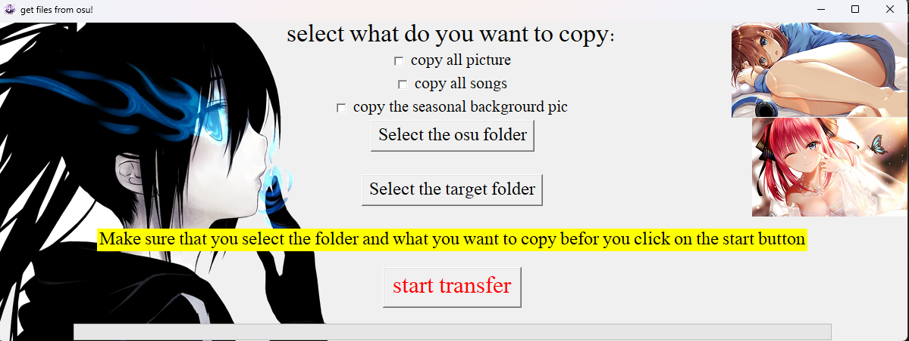

# Get files from osu!

This is a Python script that allows you to copy files from the osu! game directory to a target folder.
All this  with nice looking graphic user interface, by me...

## Features

- Copy all pictures from the osu! directory
- Copy all songs from the osu! directory
- Copy seasonal background pictures
- Select the osu! folder and target folder interactively

## Requirements

- Python 3.x
- Tkinter module
- Shutil module
- Webbrowser module
- you also have a exe file in [exe file](/exe%20file) directory

## Usage

1. Run the script `get_files_from_osu.py`.
2. Select the files you want to copy by checking the corresponding checkboxes.
3. Click on "Select the osu folder" and choose the osu! game directory.
4. Click on "Select the target folder" and choose the destination folder.
5. Click on "Start Transfer" to initiate the file copying process.
6. Wait for the process to complete.
7. The result can be found in the specified target folder.

## License

This project is licensed under the MIT License. See the [LICENSE](LICENSE) file for more information.

## Images

